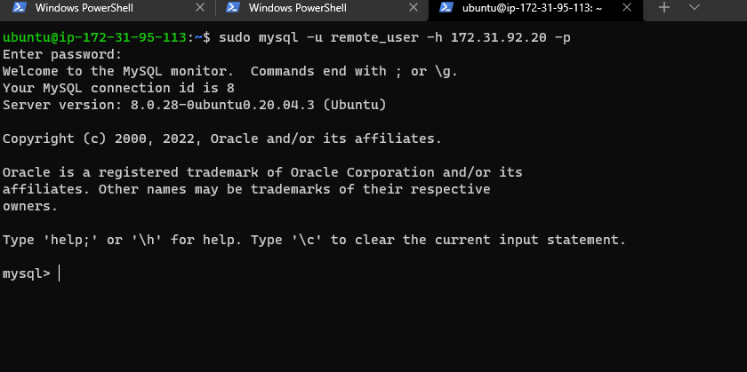

# project-5
## IMPLEMENT A CLIENT SERVER ARCHITECTURE USING MYSQL DATABASE MANAGEMENT SYSTEM (DBMS).

In this project I tried to illustrate how a  client-server relationship work in a real life scenerio.

First of all i created  created two ec2 instatnces ,one acting as the server and the acting as the client.
I installed mysql software on both  server using this commands below after an update and an upgrade

`sudo apt install mysql-server` for the server 


`sudo apt install mysql-client` fot the client


For the server i went ahead to run 

`sudo mysql_secure_installation`

for a secure installation in order to  add a secure password.

I opened up the sql on the server created a user and then a database for the user using the codes below
```
CREATE USER 'remote_user'@'%' IDENTIFIED WITH mysql_native_password BY 'PASS_88-WORD';

CREATE DATABASE test_db;

GRANT ALL ON test_db.* TO 'remote_user'@'%' WITH GRANT OPTION;

FLUSH PRIVILEGES;

```

then i went to this directorysudo

`vi /etc/mysql/mysql.conf.d/mysqld.cnf`


 file  i changes  the bind address from 172.0.0.1 it to 0.0.0.0 so that the client can easily connect to the server

After which i went to the client server to connect with this code below as show in the image below





I had initially created a security group for this server to make sure that its only possible that its the client that can connect to the server. 

After successfully connecting to the server from the client these this is what was displayed on the terminal.


